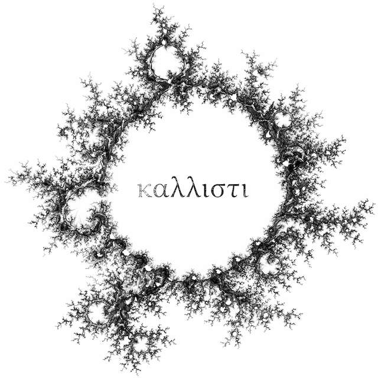

Erisische Ausschweifungen. Essays, Fragmente und Gedanken über Macht, Chaos und atheistische Religion im zweiten Viertel des 21. Jahrhunderts.

---

## Texte

1. [Eine Kritik der Gekränktheit](essays/kritik-der-gekraenktheit.md)
2. [Über den Heiligen Ernst](essays/heiliger-ernst.md)
3. [Grundlegung](/essays/grundlegung.md)
4. [Die logische Vollständigkeit der Göttin](/essays/pantheon.md)

---

## Über

srslymarco zankt sich seit über 25 Jahren in Foren und Kommentarspalten. Hier liegen die längeren Gedanken, die dazu geführt haben und zu mehr führen.

---

## Standardwerke

- [Principia Discordia, deutsche Ausgabe (scribd.com)](https://de.scribd.com/doc/66412156/Principia-Discordia)
- [Einführung in den Diskordianismus (44. Bürokratie 3191 J.u.Fr.E.)](https://media.ccc.de/v/ds25-502-einfuhrung-in-den-diskordianismus)
