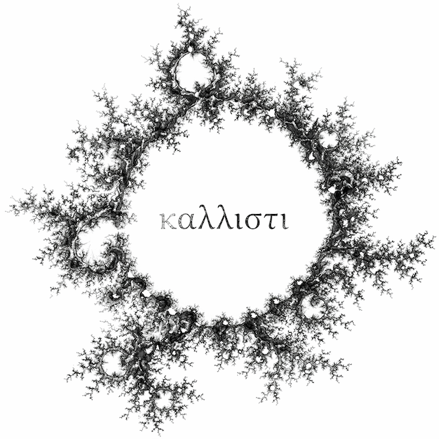

Erisische Ausschweifungen. Gedanken und Fragmente über Macht, Zwietracht, Religiosität und Atheismus im zweiten Viertel des 21. Jahrhunderts.

---

## Texte

1. [Eine Kritik der Gekränktheit](essays/kritik-der-gekraenktheit.md)
2. [Über den Heiligen Ernst](essays/heiliger-ernst.md)
3. [Grundlegung](/essays/grundlegung.md)
4. [Die logische Vollständigkeit der Göttin](/essays/pantheon.md)
5. [Über Dummheit](/essays/dummheit.md)
6. [Im Widerspruch](/essays/widerspruch.md)

---

## Über

Wir leben im Zeitalter des Streits, der Zwietracht und der Entfremdung. Menschen leben schon immer in ihren eigenen Realitäten, aber es wird zunehmend schwer bis unmöglich, sich mit anderen darüber auszutauschen, was überhaupt nachweislich real ist. Vielleicht war das schon immer so. Vielleicht fiel es nur nicht auf, weil es weniger Erzählungen über die Realität zur Auswahl gab. Vielleicht war es auch weniger wichtig weil die Welt übersichtlicher erschien.

---

## Standardwerke

- [Principia Discordia, deutsche Ausgabe (scribd.com)](https://de.scribd.com/doc/66412156/Principia-Discordia)
- [Einführung in den Diskordianismus (44. Bürokratie 3191 J.u.Fr.E.)](https://media.ccc.de/v/ds25-502-einfuhrung-in-den-diskordianismus)
