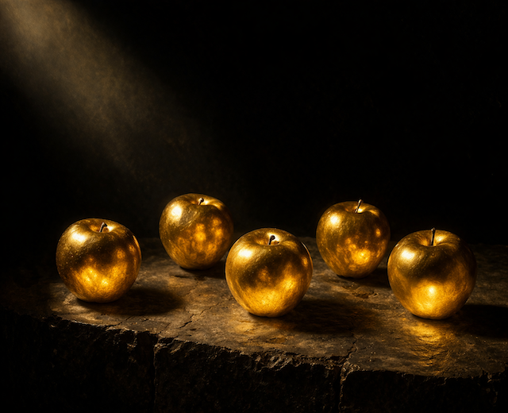

# Grundlegung
Der orthodoxe Discordianismus hat Grundsätze (oder Prinzipien), Rituale und Gebote. Aber er ist unreflektiert. Nicht ohne Grund heißt der Untertitel der *Principia Discordia* „Wie ich die Göttin fand und was ich mit ihr anstellte, als ich sie gefunden hatte.“

Dass Malaclypse der Jüngere diese Frage auf den Kopf stellt, ist sicher richtig. Während er jedoch den zweiten Teil der Frage nach der Göttin stellt, hat er offensichtlich den ersten Teil vergessen. Das kann passieren und es ist gerade der Reiz am Discordianismus, dass er bewusst offen und unvollständig ist. Wenn ich jedoch einmal erkannt habe, dass das Universum und die gesamte Existenz ist wie sie ist, stellt sich natürlich die Frage, die sich irgendwann jedem Menschen stellt: Was nun?

Diese Frage stellt der orthodoxe Discordianismus zwar, aber weicht ihrer Beantwortung in konsequenter Willkür aus. Ich denke da an den rituellen „Gobble“-Ruf, der die gleichzeitige Bedeutung und die Beliebigkeit von Ritualen zeigt. Das ist erfrischend, aber lustige Kleidung und lautmalerische Gesänge finden wir in allen Religionen. Ich will gar nicht abstreiten, dass auch in allen anderen Religionen zu viele Gläubige sich lieber auf das Performen der Rituale konzentrieren anstatt sich die eigentliche Frage zu stellen, was sie mit der Erkenntnis anfangen, die ihr Glaube ihnen gibt (oder verwehrt).

Als Eris in der Mythologie aus Gekränktheit darüber, dass sie nicht zur Hochzeit von Peleus und Thetis eingeladen wurde, den goldenen Apfel mit der Aufschrift „tē kallistē“ unter die Gäste warf, war das jedoch kein Ritual, sondern ein wirksamer Akt der Subversion. Eris und ihr Beispiel anzuerkennen, kann also nur bedeuten, ebenfalls wirksam und subversiv zu sein. Und Gründe, gekränkt zu sein, gibt es mehr als genug – allen voran die schiere Existenz allen Seins. Um das übersichtlicher zu machen, definiere ich fünf heilige Kränkungen, aus denen heraus wir tun was wir tun.

## Die 5 Heiligen Kränkungen
  
- I. Die Welt ist.
- II. Ordnung ist temporär.
- III. Das Leben schuldet dir nichts.
- IV. Gedanken sind von Realität nicht zu unterscheiden.
- V. Erkenntnis entsteht aus Widerlegung.

So wie Eris auf die Kränkung mit ihrem goldenen Apfel „für die Allerschönste“ (καλλίστῃ) reagierte, möchte ich das mit fünf Haltungen machen, die ich als die 5 goldenen Äpfel bezeichne, denn auch sie sind die Grundlagen der meisten Streitigkeiten.

## Die 5 Goldenen Äpfel
1. **ελευθερον** (ELEUTHERON) — *frei.* Nichts, was du tust, hat irgendeine kosmische Bedeutung. Das gibt dir die Freiheit, das zu tun, was richtig ist. 
2. **εφημερον** (EPHEMERON) — *vergänglich* Dein Körper, dein Geist und deine Zeit sind endlich. Sie sind das kostbarste was du hast.
3. **ισον** (ISON) — gleich.* Was du für dich selbst beanspruchst, steht auch anderen zu. Was du anderen verwehrst, verwehrst du du auch dir selbst. 
4. **σεαυτου** (SEAUTOU) — *deiner selbst.* Du bist für deine eigenen Gefühle verantwortlich und nicht für die anderer Menschen.
5. **αδηλον** (ADELON) — *ungewiss* Niemand besitzt die absolute Wahrheit. Dass du an einem Punkt Recht hast, heißt nicht, dass du dich nicht jederzeit irren kannst.

Ich behaupte, jede Religion wurde aus der Kränkung darüber gegründet, dass wir sind und die Welt ist, ohne dass es irgendeine Begründung dafür gab oder irgendein Einverständnis bestand. Seitdem suchen wir einen Sinn für das alles und erschaffen uns Märchen, die diesen Sinn stiften und Einheit geben sollen. Ironischerweise ist das in der Menschheitsgeschichte so oft passiert, dass wir seit Jahrtausenden darüber zanken, wessen Märchen das richtige ist.

Und mit diesen 5 Heiligen Kränkungen und diesen 5 Goldenen Äpfeln schlage ich vor, dass genau dieser Zank die eigentliche Religion ist. Mein Discordianismus bedeutet daher, dass Kritik an Religion und Glauben zentraler Aspekt der Ausübung meiner Religion und meines Glaubens ist.

---

