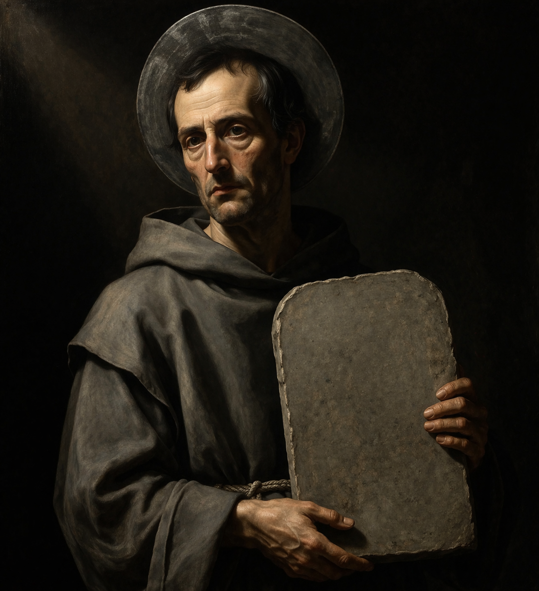

# Über den Heiligen Ernst

Zu den Dingen, die ich in den discordianischen Texten nicht verstehe, zählt das Konzept von Greyface („Graugesicht“). Wobei ich es schon verstehe, denn einen destruktiven Ernst, der sich selbst so unglaublich wichtig nimmt, dass er die völlige Sinnlosigkeit allen Seins völlig außer Acht lässt, kennen wir alle. Ich würde sogar behaupten, dass genau das Ziel dieses Verhaltens ist, die völlige Sinnlosigkeit allen Seins zu außer Acht zu lassen, indem einfach auf irgendwelche absurden Regeln bestanden wird. Letztendlich ist organisierte Religion damit die Endstufe der Bürokratie.

Interessant sind hier jedoch die algorithmisch verstärkten Aufregungsspiralen, in denen genau das zelebriert wird: Die einen versuchen den anderen zu erklären, wie die Welt ist (oder zumindest sein sollte), wer sich an welche Regeln zu halten hat oder teilen ihre Überraschung mit, wenn eben jene Regeln auch für sie selbst gelten. Und das tun alle mit dem Versuch, den absoluten Ernst der jeweils anderen Seite einen noch viel absoluteren Ernst entgegenzusetzen. Ich will mich da gar nicht davon ausnehmen, wenn ich mich dabei beobachte, wie ich hier versuche, ernsthaft und pathetisch alles niederzuschreiben und einigermaßen Ordnung in das Chaos zu bringen.

„Graugesicht“ ist also ein passender Begriff, aber er ist mir zu arg bemüht. Und er baut eine Dichotomie auf, die schlichtweg falsch ist: Denn was ist erisischer als sich darüber zu zerstreiten, wessen unnötig bürokratische Weltanschauung in Wahrheit die allerschönste ist?

Du, der Du dies liest, ahnst vielleicht schon, wohin das führt: Ich will den Discordianismus reformieren und in meiner Funktion als discordianischer Papst steht mir das auch zu.

Und somit spreche ich Greyface heilig und gebe ihm den Namen Ernst. Es sei daher nunmehr bekannt als der Heilige Ernst oder St. Gravitas.

---

