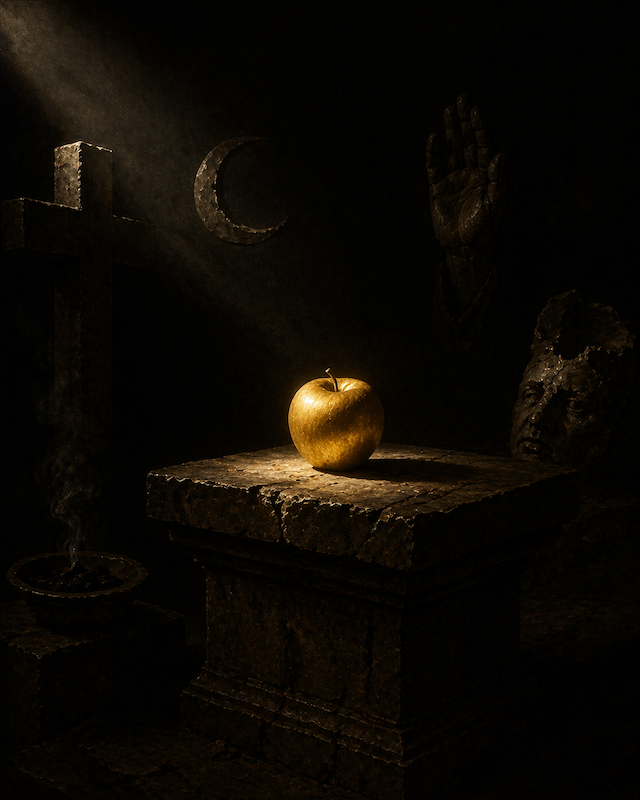

Wenn Eris existiert, existiert jede andere Gottheit. Wenn Eris eine Metapher ist, ist jede andere Gottheit eine Metapher. So ist jede Gottheit, ob metaphorisch oder nicht, ein Beweis und ein Zeugnis der Göttin.

Der Glaube an Gottheiten als Widerspruch zur Göttin ist wiederum in sich selbst eine erisische Praxis. Das bedeutet, dass vor allem der Monotheismus und auch der Atheismus, die beide in Ablehnung zur Göttin Eris stehen, folglich Konfessionen sind.

Der Glaube an Eris ist also immer polytheistisch und atheistisch – die Ablehnung des Polytheismus und des Atheismus ist immer erisisch.

---

