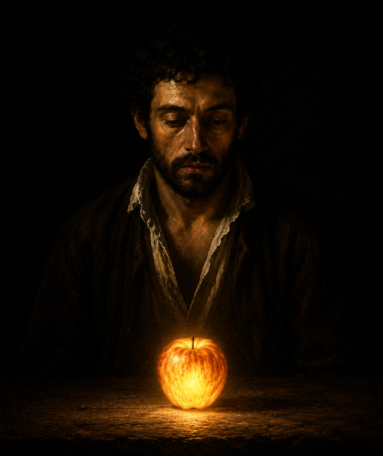

# Im Widerspruch

Es ist auffällig, wie manche Menschen, Menschen allgemein und ich ebenso, Dinge nicht sehen, obwohl sie direkt vor den Augen stehen. Das beginnt mit der Packung Käse im Kühlschrank, die meistens direkt auf Augenhöhe vorne liegt und endet damit, dass ich hier über die Göttin und die menschliche Dummheit und Streitlust schreiben kann in dem sicheren Wissen, dass die allermeisten, die sich fragen "Was ist das für ein Typ?" mit diesen Inhalten so wenig anfangen können, dass sie schlicht kognitiv ausgeblendet werden.

Was nicht ins Weltbild passt, wird also meistens gar nicht erst gesehen. Erst wenn es sich wirklich nicht mehr ausblenden lässt, muss folglich versucht werden, es in das eigene Weltbild einzuordnen. Und damit wird dieses Weltbild wiederum weiter bestätigt.

Auf diese Weise werden solche Weltbilder nicht nur unwiderlegbar, sondern sie werden durch Widerspruch eben verstärkt – vielleicht sogar noch mehr als durch Zustimmung – und zwar durch den Fehlschluss "Wenn die Falschen gegen mich sind, muss ich folglich richtig sein."

Diese These bestätigt sich durch meine Beobachtung, dass wenn ich in Diskussionen keine Gegenposition einnehme, die spannendsten Dinge passieren. Meistens wird erst ausgewichen oder abgelenkt, anstatt die eigene Position einfach mal zu begründen – und wenn das nicht hilft, werden mir je nach Kürze der emotionalen Zündschur dann Positionen oder Eigenschaften unterstellt, die zum Teil so absurd sein können, dass sie zufällig sogar der Wahrheit entsprechen.

Und darin unterscheidet sich mein Erisentum vom modernen Satanismus und auch vom Pastafarianismus: Wo der Satanismus nicht nur eine Gegenposition einnimmt, sondern diese Gegenposition religiös verkörpert, nimmt der Pastafarianismus ebenfalls eine Gegenposition durch Spott ein. Beide ziehen ihre Legitimation durch die Existenz des Einen (in diesem Fall das Christentum) und verstehen sich entsprechend als das Andere zu diesem Einen. Das ist gut und berechtigt, aber in diesem Widerspruch zum Einen wird dieses Eine eben in seiner Existenz bestätigt.

Der orthodoxe Discordianismus tut das auch, verstrickt sich dabei aber so sehr in sich selbst, dass er keine Relevanz hat und von der Konkurrenz sowie von der Wirklichkeit überholt wurde. Deshalb rede ich hier auch nicht vom Discordianismus, sondern vom Erisentum.

Die Endung "-ismus" ist hier auch verräterisch, wenn aus dem Christen-tum heraus (oder im Widerspruch dazu) ein Satan-ismus, ein Pastafarian-ismus oder eben ein Discordian-ismus entstehen und nicht etwa ein Satanentum, ein Pastafaritum oder ein Discordiatum. Dass diese Begriffe auch irgendwie eigentümlich klingen, aber ein Christenum nicht, ist überdies vielsagend.

Was passiert also, wenn ich dem Einen nicht aus der Position des Anderen heraus widerspreche, sondern aus der Position des Widerspruchs selbst?

Natürlich kann ich dann immer noch als "anderer" markiert werden, aber das passiert dann oftmals dermaßen willkürlich und verzweifelt, dass es keine Rolle spielt. Deshalb rede ich vom Erisentum und konkret von meinem Erisentum, statt von einem weiteren -ismus.

Die Position des Erisentums ist der Streit im besten Sinne: Das Hinterfragen von Dogmen ist das Dogma. Das Kritisieren von Religion ist die Religion. Und die Ablehnung von Gottheiten ist der Dienst an der Gottheit.

---

